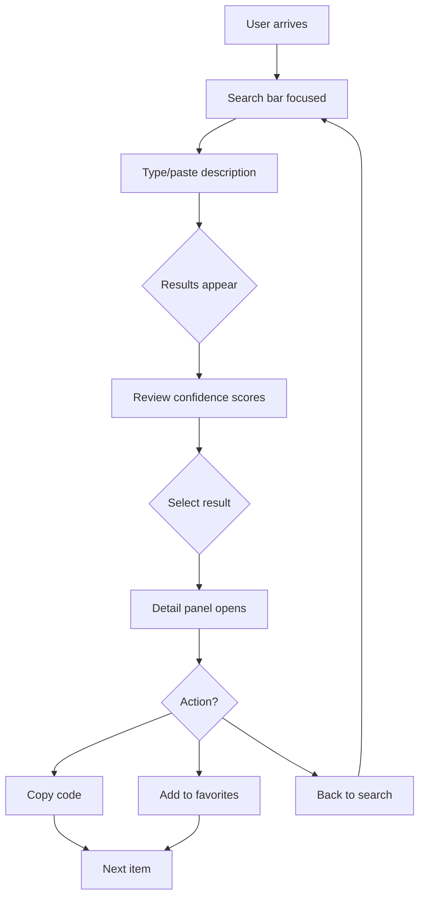
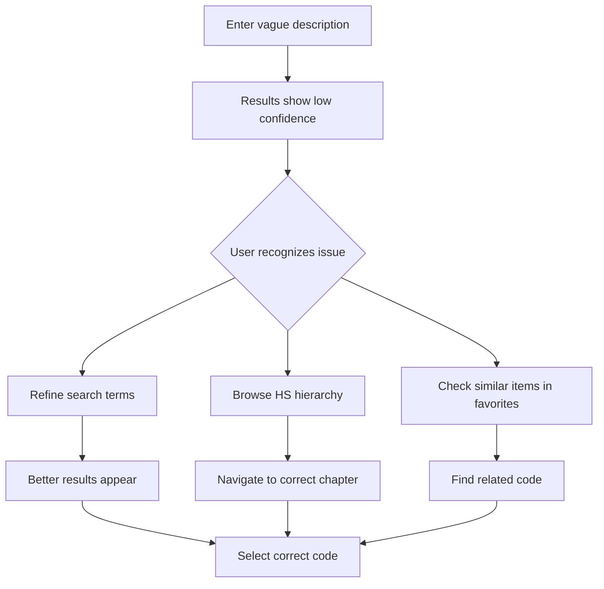
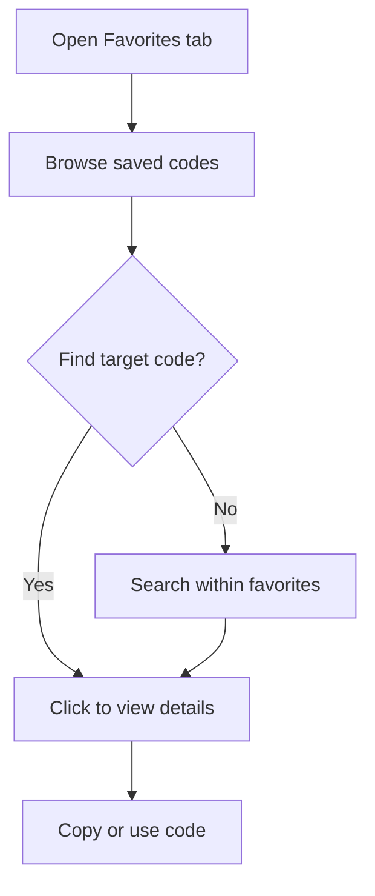
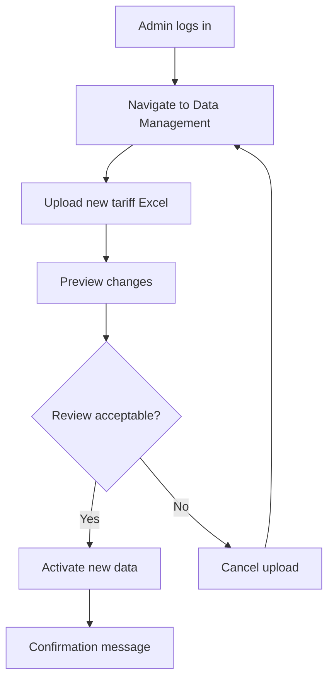

# UX Design Specification - Athena

**Author:** tinsu
**Date:** 2026-01-26
**Status:** Complete

---

## Executive Summary

### Project Vision

Athena is a specialized HS code lookup tool that transforms customs classification for Vietnamese logistics operations. It replaces fragmented manual workflows (Excel + government portals + institutional knowledge) with an intelligent, multi-language search system built on official 2025 Vietnam Customs tariff data (19,901 HS codes).

**The "elevator pitch":** Type any product description in Vietnamese, English, or Chinese - get the correct HS code with complete duty rates in under 10 seconds.

### Target Users

**Primary User - Linh (Customs Declaration Specialist):**
- Mid-level customs staff, 4+ years experience
- Processes 80-120 line items daily under time pressure
- Receives documents in mixed languages (VN, EN, ZH)
- Core frustration: ambiguous descriptions like "plastic parts" or "electronic accessories"
- Currently juggles Excel files, government portals, and senior colleagues

**Secondary Users:**
| User | Role | Primary Need |
|------|------|--------------|
| Hoa (Team Manager) | Oversight | Team throughput metrics, error reduction |
| Minh (IT Admin) | Maintenance | Annual tariff data updates |
| Operations Director | Decision maker | ROI validation |

### Key Design Challenges

1. **High-Volume Workflow Optimization:** Hundreds of lookups daily - every extra click compounds into hours lost
2. **Confidence Communication:** Displaying relevance scores that build trust without creating doubt
3. **Multi-Language Input Reality:** Seamless handling of VN/EN/ZH input without mode switching
4. **Dense Information Display:** 20+ FTA rates per code without overwhelming users
5. **Ambiguous Query Handling:** Graceful guidance when confidence is low

### Design Opportunities

1. **Favorites as Power Feature:** Make 50%+ of repeat lookups instant
2. **Speed as Brand:** Sub-3s response creates addictive efficiency
3. **Bilingual Display Advantage:** VN+EN descriptions shown together without translation delays
4. **Confidence-Based UI Adaptation:** Different detail levels based on match quality

---

## Core User Experience

### Defining Experience

**"Describe it, find it, done."**

The defining experience for Athena is the moment Linh pastes a messy product description and instantly sees the correct HS code with high confidence. Like Tinder's swipe or Spotify's instant play, this single interaction defines the product's value.

**Core interaction:** Search bar → Confidence-ranked results → Select code → Copy/favorite → Next item

### Platform Strategy

| Platform | Priority | Approach |
|----------|----------|----------|
| **Desktop (primary)** | P0 | Full-featured, keyboard-optimized |
| **Tablet** | P1 | Touch-optimized, responsive layout |
| **Mobile** | P2 | Functional but not primary use case |

**Rationale:** Customs work happens at office desks with full keyboards. Speed comes from keyboard shortcuts, not touch interfaces.

### Effortless Interactions

| Interaction | Effortless Behavior |
|-------------|---------------------|
| **Search input** | Single field accepts any language, no mode selection |
| **Result selection** | Click or keyboard Enter selects code |
| **Copy to clipboard** | One-click copy of formatted code details |
| **Add to favorites** | Star icon, no modal or confirmation |
| **Re-search from history** | Click to populate search, auto-execute |

### Critical Success Moments

| Moment | Success Indicator |
|--------|-------------------|
| **First successful lookup** | User finds correct code faster than Excel |
| **Ambiguous description resolved** | Tool surfaces correct code that user couldn't find manually |
| **Repeat lookup instant** | Favorites provide zero-search-time access |
| **Confidence validated** | High-confidence result passes customs validation |

### Experience Principles

1. **Speed over features** - Every design decision optimizes for time-to-code
2. **Confidence builds trust** - Clear indicators help users act decisively
3. **Keyboard-first, mouse-friendly** - Power users fly, casual users comfortable
4. **Progressive disclosure** - Essential info first, details on demand
5. **No dead ends** - Low-confidence results offer clear next steps

---

## Desired Emotional Response

### Primary Emotional Goals

| Emotion | Design Implication |
|---------|-------------------|
| **Confident** | Clear confidence scores, validated results |
| **Efficient** | Sub-second interactions, minimal clicks |
| **In control** | Predictable behavior, undo-friendly actions |
| **Accomplished** | Progress tracking, completion feedback |

### Emotional Journey Mapping

| Stage | Desired Emotion | Design Support |
|-------|-----------------|----------------|
| **First discovery** | Intrigued, hopeful | Clean interface, immediate value demo |
| **First search** | Impressed, relieved | Fast results, correct code surfaces |
| **Regular use** | Efficient, trusted | Favorites accumulate, history accessible |
| **Ambiguous query** | Guided, not frustrated | Low-confidence guidance, alternative suggestions |
| **Error/failure** | Informed, not blamed | Clear error messages, recovery paths |

### Micro-Emotions

| Positive (Cultivate) | Negative (Avoid) |
|---------------------|------------------|
| Confidence in results | Doubt about accuracy |
| Speed satisfaction | Impatience waiting |
| Control over workflow | Confusion about next steps |
| Trust in the tool | Skepticism of confidence scores |

### Emotional Design Principles

1. **Celebrate success quietly** - No confetti, just smooth flow to next task
2. **Explain uncertainty** - Low confidence with clear reasoning beats false certainty
3. **Respect expertise** - Users are professionals; don't over-explain basics
4. **Fail gracefully** - Errors should feel like "try this instead" not "you broke it"

---

## UX Pattern Analysis & Inspiration

### Inspiring Products Analysis

**1. Algolia InstantSearch**
- **What they nail:** Sub-100ms search with typo tolerance
- **Transferable:** Instant feedback, debounced input, highlight matched terms
- **Adaptation:** Apply to HS code descriptions with confidence scoring

**2. Raycast**
- **What they nail:** Keyboard-first navigation, command palette UX
- **Transferable:** Arrow key navigation, Enter to select, Esc to clear
- **Adaptation:** Power user shortcuts for high-volume workflow

**3. Linear**
- **What they nail:** Dense information without feeling cluttered
- **Transferable:** Subtle visual hierarchy, whitespace discipline
- **Adaptation:** Tariff data tables with clear scan lines

**4. Notion**
- **What they nail:** Slash commands, favorites/recent patterns
- **Transferable:** Quick actions, personal organization features
- **Adaptation:** Favorites with notes, recent history access

### Transferable UX Patterns

**Navigation Patterns:**
- Command palette style search (always accessible)
- Breadcrumb hierarchy for HS code structure browsing
- Tab navigation between Search / Favorites / History

**Interaction Patterns:**
- Instant search with debounce (150ms delay)
- Keyboard shortcuts for power users (/, Cmd+K to search)
- Click-outside to dismiss, Esc to cancel

**Visual Patterns:**
- Cards for search results with clear hierarchy
- Subtle confidence indicators (color-coded badges)
- Expandable detail panels for full tariff info

### Anti-Patterns to Avoid

| Anti-Pattern | Why Avoid | Alternative |
|--------------|-----------|-------------|
| **Pagination** | Breaks flow, hides potentially correct results | Infinite scroll or load more |
| **Modal confirmations** | Slows high-volume workflow | Inline actions with undo |
| **Complex filters upfront** | Cognitive overload for simple searches | Progressive filter reveal |
| **Auto-playing tutorials** | Interrupts expert users | Help on demand |
| **Skeleton loaders everywhere** | Creates anxiety about speed | Optimistic UI where possible |

### Design Inspiration Strategy

**Adopt:**
- Algolia-style instant search feedback
- Linear's information density approach
- Raycast's keyboard navigation

**Adapt:**
- Notion's favorites pattern → HS code favorites with notes
- Command palette → Search always in header, not modal

**Avoid:**
- Google's multi-step search refinement
- Enterprise software's filter-first approach
- Consumer app's gamification elements

---

## Design System Foundation

### Design System Choice

**Selected:** Tailwind CSS + shadcn/ui components

**Rationale:**
| Factor | Decision |
|--------|----------|
| **Speed to build** | shadcn provides pre-built, accessible components |
| **Customization** | Tailwind allows full brand customization |
| **Tech stack fit** | Perfect for Next.js 15+ architecture |
| **Team capability** | Intermediate skill level matches Tailwind learning curve |
| **Maintenance** | Components are copied, not dependency-locked |

### Implementation Approach

1. Install shadcn/ui with Tailwind CSS in Next.js project
2. Customize design tokens (colors, spacing, typography)
3. Build custom components for HS-specific UI (ResultCard, ConfidenceBadge, TariffTable)
4. Document patterns in Storybook (future phase)

### Customization Strategy

**Foundation tokens from shadcn:**
- Button, Input, Card, Table, Badge, Modal primitives
- Built-in dark mode support
- Accessible by default (ARIA, keyboard nav)

**Custom components to build:**
- SearchBar with language detection indicator
- ResultCard with confidence visualization
- TariffDetailPanel with FTA rates accordion
- FavoriteCard with notes
- HistoryItem with re-search action

---

## Core Interaction Definition

### The Defining Moment

**"Paste description → See correct code → Move on"**

This is Athena's equivalent of Tinder's swipe. If this interaction feels magical, users are hooked. If it feels slow or uncertain, the tool fails.

### User Mental Model

**Current mental model (Excel workflow):**
1. Open tariff Excel
2. Ctrl+F search for keywords
3. Scroll through partial matches
4. Cross-reference with government portal
5. Ask colleague if unsure
6. Copy code manually

**Target mental model (Athena):**
1. Paste/type description
2. See ranked results with confidence
3. Select correct code
4. Done (auto-copied or favorited)

### Success Criteria

| Criteria | Target | Measurement |
|----------|--------|-------------|
| **Time to first result** | <3 seconds | Performance monitoring |
| **Clicks to select code** | 1 click or Enter | Interaction tracking |
| **Confidence accuracy** | 80%+ correct in top 3 | User feedback |
| **Repeat lookup time** | <1 second via favorites | Usage analytics |

### Experience Mechanics

**1. Initiation:**
```
User arrives → Search bar is focused → Cursor blinking, ready for input
No login wall for search (auth for favorites/history)
```

**2. Interaction:**
```
User types/pastes → Debounce 150ms → Search executes
Results stream in → Top result highlighted
Arrow keys navigate → Enter selects → Details expand
```

**3. Feedback:**
```
Typing: Character count, language detection hint
Searching: Subtle loading indicator (not blocking)
Results: Confidence badges (green/yellow/red)
Selection: Detail panel slides in from right
```

**4. Completion:**
```
Code selected → Copy button prominent
Add to favorites (star) → No confirmation modal
Back to search → Previous results maintained
```

### Novel vs. Established Patterns

| Element | Pattern Type | Approach |
|---------|--------------|----------|
| **Search bar** | Established | Standard single input, Google-familiar |
| **Confidence scores** | Novel | Educate via tooltip on first use |
| **Multi-language input** | Novel | Subtle language detection indicator |
| **FTA rate accordion** | Established | Standard expand/collapse |
| **Favorites with notes** | Established | Pinterest/Notion pattern |

---

## Visual Design Foundation

### Color System

**Primary Palette:**

| Token | Hex | Usage |
|-------|-----|-------|
| `--primary` | `#2563EB` | Primary actions, links, focus states |
| `--primary-hover` | `#1D4ED8` | Hover states |
| `--primary-muted` | `#DBEAFE` | Backgrounds, badges |

**Semantic Colors:**

| Token | Hex | Usage |
|-------|-----|-------|
| `--success` | `#16A34A` | High confidence (80%+), success states |
| `--warning` | `#CA8A04` | Medium confidence (50-80%), caution |
| `--error` | `#DC2626` | Low confidence (<50%), errors |
| `--info` | `#0891B2` | Informational, links |

**Neutral Palette:**

| Token | Hex | Usage |
|-------|-----|-------|
| `--background` | `#FFFFFF` | Page background |
| `--foreground` | `#0F172A` | Primary text |
| `--muted` | `#64748B` | Secondary text |
| `--border` | `#E2E8F0` | Borders, dividers |
| `--card` | `#F8FAFC` | Card backgrounds |

**Confidence Color Mapping:**

| Confidence | Color | Badge Text |
|------------|-------|------------|
| 80-100% | Green (`--success`) | "High Match" |
| 50-79% | Yellow (`--warning`) | "Possible Match" |
| <50% | Red (`--error`) | "Low Match - Verify" |

### Typography System

**Font Stack:**

```css
--font-sans: 'Inter', -apple-system, BlinkMacSystemFont, sans-serif;
--font-mono: 'JetBrains Mono', 'Fira Code', monospace;
```

**Type Scale:**

| Token | Size | Weight | Line Height | Usage |
|-------|------|--------|-------------|-------|
| `--text-xs` | 12px | 400 | 1.5 | Captions, badges |
| `--text-sm` | 14px | 400 | 1.5 | Secondary text, labels |
| `--text-base` | 16px | 400 | 1.5 | Body text, inputs |
| `--text-lg` | 18px | 500 | 1.4 | Card titles |
| `--text-xl` | 20px | 600 | 1.3 | Section headers |
| `--text-2xl` | 24px | 700 | 1.2 | Page titles |

**HS Code Display:**
```css
.hs-code {
  font-family: var(--font-mono);
  font-size: 18px;
  font-weight: 600;
  letter-spacing: 0.05em;
}
```

### Spacing & Layout Foundation

**Base Unit:** 4px

**Spacing Scale:**

| Token | Value | Usage |
|-------|-------|-------|
| `--space-1` | 4px | Tight gaps, icon padding |
| `--space-2` | 8px | Inline elements, badge padding |
| `--space-3` | 12px | Card padding (small) |
| `--space-4` | 16px | Default element spacing |
| `--space-6` | 24px | Section spacing, card padding |
| `--space-8` | 32px | Large section gaps |
| `--space-12` | 48px | Page section dividers |

**Layout Grid:**

```css
/* Desktop */
.container {
  max-width: 1280px;
  padding: 0 24px;
  margin: 0 auto;
}

/* Main layout */
.layout {
  display: grid;
  grid-template-columns: 280px 1fr; /* Sidebar + Main */
  gap: 24px;
}
```

### Accessibility Considerations

| Requirement | Implementation |
|-------------|----------------|
| **Color contrast** | 4.5:1 minimum for all text |
| **Focus indicators** | 2px solid primary with offset |
| **Touch targets** | 44x44px minimum |
| **Motion** | Respect `prefers-reduced-motion` |
| **Screen readers** | ARIA labels on all interactive elements |

---

## Design Direction

### Chosen Direction: "Professional Efficiency"

A clean, business-focused design that prioritizes speed and clarity over visual flair. Information-dense without feeling cluttered. Confident use of whitespace. Subtle visual feedback that doesn't distract.

**Visual Characteristics:**
- Light background with subtle card elevation
- Blue accent color for trust and professionalism
- Clear visual hierarchy through size and weight
- Minimal decoration, maximum function

### Design Rationale

| Principle | Implementation |
|-----------|----------------|
| **Trust** | Professional color palette, no gimmicks |
| **Speed** | Dense information, minimal scrolling |
| **Clarity** | Strong hierarchy, predictable layouts |
| **Focus** | Search bar dominates, results immediate |

### Key Visual Elements

**Search Bar:**
- Full-width, prominent placement
- Subtle shadow to elevate from background
- Clear icon, placeholder text
- Language detection indicator (subtle flag/text)

**Result Cards:**
- White background, subtle border
- HS code in monospace, large
- Confidence badge top-right
- Description preview, expandable

**Detail Panel:**
- Slide-in from right (overlay on mobile)
- Tabbed content: Overview / FTA Rates / Policy Notes
- Copy button prominent
- Favorite star easily accessible

---

## User Journey Flows

### Journey 1: Standard Search Flow



### Journey 2: Ambiguous Query Recovery



### Journey 3: Repeat Lookup via Favorites



### Journey 4: Admin Data Update



### Flow Optimization Principles

1. **Minimize clicks to value** - First result should often be correct
2. **Keyboard shortcuts** - Power users never touch mouse
3. **Preserve context** - Back action doesn't lose search state
4. **Clear recovery paths** - Low confidence offers actionable next steps
5. **No confirmation fatigue** - Actions are undoable, not blocked

---

## Component Strategy

### Design System Components (from shadcn/ui)

| Component | Usage |
|-----------|-------|
| `Button` | Primary/secondary actions |
| `Input` | Search bar, form fields |
| `Card` | Result cards, detail panels |
| `Badge` | Confidence indicators, tags |
| `Table` | FTA rates, tariff data |
| `Tabs` | Detail panel sections |
| `Dialog` | Confirmation modals (minimal use) |
| `Tooltip` | Confidence explanation, help |
| `Dropdown` | User menu, language selector |

### Custom Components

#### SearchBar
**Purpose:** Primary search input with language detection
**States:** Empty, typing, loading, results
**Features:**
- Auto-focus on page load
- Language detection indicator
- Clear button
- Keyboard shortcut hint (/)

#### ResultCard
**Purpose:** Display single HS code search result
**Props:** `hsCode`, `descriptionVn`, `descriptionEn`, `confidence`, `onSelect`
**States:** Default, hover, selected
**Features:**
- Confidence badge (color-coded)
- Truncated descriptions with expand
- Quick-copy button

#### ConfidenceBadge
**Purpose:** Visual indicator of match quality
**Props:** `score` (0-100)
**Variants:** High (green), Medium (yellow), Low (red)
**Features:**
- Tooltip explaining score meaning
- Accessible color + icon combination

#### TariffDetailPanel
**Purpose:** Full HS code details with all rates
**Sections:** Overview, FTA Rates, Policy Notes
**Features:**
- Tabbed navigation
- Accordion for 20+ FTA rates
- Copy formatted data
- Add to favorites

#### FavoriteCard
**Purpose:** Display saved HS code with user notes
**Features:**
- Personal notes field
- Quick re-search
- Delete with undo

#### HistoryItem
**Purpose:** Display past search with result
**Features:**
- Query text
- Selected code (if any)
- One-click re-execute

### Implementation Roadmap

**Phase 1 - Core (MVP):**
- SearchBar, ResultCard, ConfidenceBadge
- TariffDetailPanel (basic)
- Basic layout components

**Phase 2 - Personalization:**
- FavoriteCard with notes
- HistoryItem with re-search
- User preferences

**Phase 3 - Enhancement:**
- HS Code Browser (hierarchical)
- Advanced filtering
- Bulk lookup

---

## UX Consistency Patterns

### Button Hierarchy

| Level | Style | Usage |
|-------|-------|-------|
| **Primary** | Filled blue | Main CTA (Search, Save, Confirm) |
| **Secondary** | Outlined blue | Alternative actions (Cancel, Back) |
| **Ghost** | Text only | Tertiary actions (Help, Skip) |
| **Destructive** | Red outlined | Delete, Clear all |

### Feedback Patterns

| Feedback Type | Visual | Duration | Dismissal |
|---------------|--------|----------|-----------|
| **Success** | Green toast, bottom-right | 3s | Auto + click |
| **Error** | Red toast, bottom-right | 5s | Click only |
| **Warning** | Yellow inline alert | Persistent | Action resolves |
| **Info** | Blue tooltip | On hover | Mouse leave |
| **Loading** | Subtle spinner | Until complete | N/A |

### Form Patterns

| Pattern | Implementation |
|---------|----------------|
| **Validation** | On blur, not on type |
| **Error display** | Below field, red text |
| **Required fields** | Asterisk + "(required)" for a11y |
| **Submit** | Disabled until valid |

### Navigation Patterns

| Element | Behavior |
|---------|----------|
| **Header** | Fixed, always visible |
| **Search** | Always in header, not page-specific |
| **Sidebar** | Collapsible on tablet, hidden on mobile |
| **Tabs** | Underline style, keyboard navigable |
| **Back** | Browser back preserves state |

### Empty States

| State | Message | Action |
|-------|---------|--------|
| **No results** | "No HS codes match your search" | Suggestions, refine tips |
| **No favorites** | "Save codes for quick access" | Link to search |
| **No history** | "Your search history will appear here" | Start searching |

### Loading States

| Context | Pattern |
|---------|---------|
| **Search** | Skeleton cards (3), subtle pulse |
| **Detail panel** | Skeleton lines |
| **Page load** | Full page skeleton |
| **Action** | Button spinner, disabled state |

---

## Responsive Design & Accessibility

### Responsive Strategy

**Desktop (1024px+):**
- Full sidebar navigation
- Detail panel as right drawer
- Dense information display
- Keyboard shortcuts prominent

**Tablet (768px - 1023px):**
- Collapsible sidebar (hamburger)
- Detail panel as modal overlay
- Touch-optimized targets
- Horizontal scroll for FTA tables

**Mobile (320px - 767px):**
- Bottom navigation bar
- Full-screen detail view
- Simplified result cards
- Vertical FTA rate list

### Breakpoint Strategy

```css
/* Mobile first */
@media (min-width: 768px) { /* Tablet */ }
@media (min-width: 1024px) { /* Desktop */ }
@media (min-width: 1280px) { /* Large desktop */ }
```

### Accessibility Strategy

**WCAG 2.1 AA Compliance:**

| Requirement | Implementation |
|-------------|----------------|
| **Color contrast** | 4.5:1 text, 3:1 UI components |
| **Keyboard navigation** | Full tab order, arrow keys in lists |
| **Screen readers** | ARIA labels, live regions for search |
| **Focus management** | Visible focus ring, logical order |
| **Motion** | Respect `prefers-reduced-motion` |

### Accessibility Checklist

- [x] All images have alt text
- [x] Form inputs have labels
- [x] Interactive elements are keyboard accessible
- [x] Color is not sole indicator (icons + color)
- [x] Focus order matches visual order
- [x] Error messages are associated with fields
- [x] Skip link to main content
- [x] Heading hierarchy is logical

### Testing Strategy

**Automated:**
- axe-core in CI pipeline
- Lighthouse accessibility audits
- ESLint jsx-a11y plugin

**Manual:**
- Keyboard-only navigation test
- Screen reader testing (NVDA, VoiceOver)
- Color blindness simulation

### Implementation Guidelines

**Responsive Development:**
```tsx
// Mobile-first component
function ResultCard({ result }) {
  return (
    <div className="p-4 md:p-6 lg:flex lg:items-start lg:gap-4">
      {/* Content adapts to breakpoint */}
    </div>
  );
}
```

**Accessible Interactive:**
```tsx
// Accessible button with loading state
<Button
  aria-busy={isLoading}
  aria-label={isLoading ? "Searching..." : "Search"}
  disabled={isLoading}
>
  {isLoading ? <Spinner /> : "Search"}
</Button>
```

---

## Implementation Handoff Summary

### Design Specification Checklist

- [x] Executive summary and project vision
- [x] Target users and emotional goals
- [x] Core experience definition
- [x] Design system choice (Tailwind + shadcn/ui)
- [x] Visual foundation (colors, typography, spacing)
- [x] User journey flows with diagrams
- [x] Component strategy and specifications
- [x] UX consistency patterns
- [x] Responsive and accessibility strategy

### Developer Quick Reference

**Technology:**
- Next.js 15+ with App Router
- Tailwind CSS + shadcn/ui components
- TypeScript strict mode

**Key Files to Create:**
```
web/src/
├── app/search/page.tsx          # Main search interface
├── app/search/components/
│   ├── SearchBar.tsx
│   ├── ResultsList.tsx
│   ├── ResultCard.tsx
│   └── ConfidenceBadge.tsx
├── app/hs-codes/[code]/page.tsx # Detail view
├── app/favorites/page.tsx       # Favorites management
├── components/ui/               # shadcn components
└── lib/store.ts                 # Zustand state
```

**Design Tokens (Tailwind config):**
```js
// tailwind.config.js
module.exports = {
  theme: {
    extend: {
      colors: {
        primary: '#2563EB',
        success: '#16A34A',
        warning: '#CA8A04',
        error: '#DC2626',
      },
      fontFamily: {
        sans: ['Inter', 'sans-serif'],
        mono: ['JetBrains Mono', 'monospace'],
      },
    },
  },
}
```

### Next Steps

1. **Component Development** - Build SearchBar, ResultCard, ConfidenceBadge
2. **Layout Implementation** - Create responsive shell with header/sidebar
3. **Search Integration** - Connect to FastAPI search endpoint
4. **User Testing** - Validate search UX with actual customs staff
5. **Iteration** - Refine based on feedback

---

**UX Design Specification Complete**

This document provides the comprehensive foundation for implementing Athena's user interface. All design decisions prioritize the core value proposition: fast, confident HS code lookup for high-volume customs workflow.
